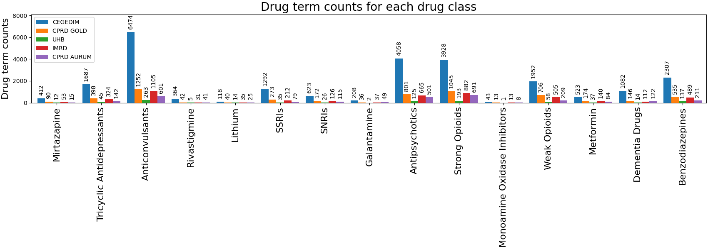

# AI-MLTC Drug Lists
<!-- ALL-CONTRIBUTORS-BADGE:START - Do not remove or modify this section -->

<!-- ALL-CONTRIBUTORS-BADGE:END -->
 [![CC BY 4.0][cc-by-shield]][cc-by]

This repository has been setup to share drug lists across NIHR's AIM projects.
Currently, the drug lists come from the AIM Consortium OPTIMAL, based in Birmingham.
You can find all the drug lists created by OPTIMAL in [this repository]([https://github.com/aim-rsf/phenotypes/tree/main/Drug%20Codes](https://github.com/THINKINGGroup/phenotypes/tree/main/Drug%20Codes)).

## About the lists
There is variation in how different systems approach the classification and mapping of various drugs, and it has been noted that there is a lack of single data consistency. 

The drug lists have been created using different methods to find a more efficient process to integrate as part of the Code Builder tool:

- **Method 1**: Involved manually curating a list of generic drug names on the BNF, and searching for respective brand names on the dm+d browser
- **Method 2**: Involves the use of both the [`snomedizer`](https://github.com/ramses-antibiotics/snomedizer) `R` package and a dm+d tool implementation (downloading latest dm+d distribution from NHS [Technology Reference Update Distribution TRUD webpage](https://isd.digital.nhs.uk/trud/users/guest/filters/0/home)). It's in the pipeline to create a self-contained wrapper for this process.
  - this method is a substance-based approach and involves running through a list of IDs for medicinal products.

The process for the creation of the lists can be found in the [generation-process folder](/generation-process) and the drug lists themselves in the [drug-lists folder](/drug-lists).

Figure below gives a count of the drug terms contained for each drug class categorised by data source, in the drug-lists folder.

## Further context in our recent article 

Our recent article provides further context about how and why these drug lists were developed and how they are used in health research. Read the pre-print for our paper [here](https://doi.org/10.5281/zenodo.12705968) and the abstract below.

Title: Clinical coding in multiple long-term conditions research: challenges and best practices

Abstract: _Access to health data, of good enough volume and quality, is central to our understanding of multiple long-term conditions (MLTCs) and how to treat them. There is a rise in the use of health data for cohort selection using clinical codes, with the potential to advance areas of MLTC treatment and polypharmacy research. We have reviewed literature with published methodologies to discuss current understanding and potential challenges around coding of clinical data, selection of data sources (e.g. electronic health records) and validity of the decision making process. We include a suggested frame- work to curate drug lists with clinician input and provide an extensive list of resources to assist MLTC researchers to access or create code lists, prioritising re-usability and transparency. Sharing best practice guidelines and agreeing on standards can help this research field move towards having a unified approach to structuring and coding clinical information, with the ultimate goal being more accurate and effective clinical decision making._

# Contributors and Acknowledgments ✨

This repository is created and maintained by the [AI for Multiple Long Term Conditions Research Support Facility (AIM-RSF)](https://www.turing.ac.uk/research/research-projects/ai-multiple-long-term-conditions-research-support-facility) (link to the [same archived website](https://web.archive.org/web/20250212145350/https://www.turing.ac.uk/research/research-projects/ai-for-multiple-long-term-conditions-research-support-facility?__cf_chl_rt_tk=XKaDrLiiU8hmzZk2rKaWDBVpnO8exVqC4EHijqlWTIQ-1739372030-1.0.1.1-hmHFksRkdOQcBH9PsOgRVdNAatQdr3i4hFOqtyPcyZU)). AIM RSF is funded by the NIHR Artificial Intelligence for Multiple Long-Term Conditions (AIM) programme (NIHR202647). The views expressed are those of the author(s) and not necessarily those of the NIHR or the Department of Health and Social Care.

Thanks goes to these wonderful people ([emoji key](https://allcontributors.org/docs/en/emoji-key)):

<!-- ALL-CONTRIBUTORS-LIST:START - Do not remove or modify this section -->
<!-- prettier-ignore-start -->
<!-- markdownlint-disable -->
<table>
  <tbody>
    <tr>
      <td align="center" valign="top" width="14.28%"><a href="https://github.com/JennyCooper1"> <b>JennyCooper1</b></a> <a href="#content-JennyCooper1" title="Content">🖋</a> <a href="https://github.com/aim-rsf/drug-lists/commits?author=JennyCooper1" title="Documentation">📖</a> <a href="#ideas-JennyCooper1" title="Ideas, Planning, & Feedback">🤔</a></td>
      <td align="center" valign="top" width="14.28%"><a href="https://github.com/Rainiefantasy"> <b>Mahwish M</b></a> <a href="#content-Rainiefantasy" title="Content">🖋</a> <a href="https://github.com/aim-rsf/drug-lists/commits?author=Rainiefantasy" title="Documentation">📖</a></td>
      <td align="center" valign="top" width="14.28%"><a href="https://github.com/eirini-zormpa"> <b>Eirini Zormpa</b></a> <a href="https://github.com/aim-rsf/drug-lists/commits?author=eirini-zormpa" title="Documentation">📖</a></td>
    </tr>
  </tbody>
</table>

<!-- markdownlint-restore -->
<!-- prettier-ignore-end -->

<!-- ALL-CONTRIBUTORS-LIST:END -->

This project follows the [all-contributors](https://github.com/all-contributors/all-contributors) specification. Specifically, 🖋️ `content` refers to creation of drug lists, 📖 `documentation` refers to the documentation created in this repository, and 🤔 `Feedback` refers to clinical auditing of the lists.

If you would like to contribute to this repository, e.g. because you have found an error, or because you have a code list you would like to contribute, please [open an issue](https://github.com/aim-rsf/drug-lists/issues/new), or email either Mahwish at [mmohammad@turing.ac.uk](mailto:mmohammad@turing.ac.uk) or the team at [aimrsf@turing.ac.uk](mailto:aimrsf@turing.ac.uk).

## Licence
The materials in this repository are free to reuse under the conditions of the [Creative Commons Attribution 4.0 licence](http://creativecommons.org/licenses/by/4.0/).

[![CC BY 4.0][cc-by-image]][cc-by]

[cc-by]: http://creativecommons.org/licenses/by/4.0/
[cc-by-image]: https://i.creativecommons.org/l/by/4.0/88x31.png
[cc-by-shield]: https://img.shields.io/badge/License-CC%20BY%204.0-lightgrey.svg
